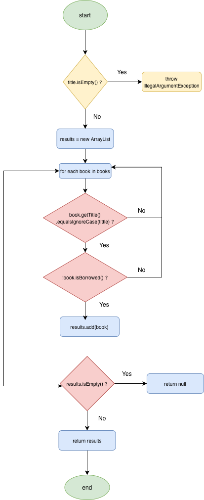
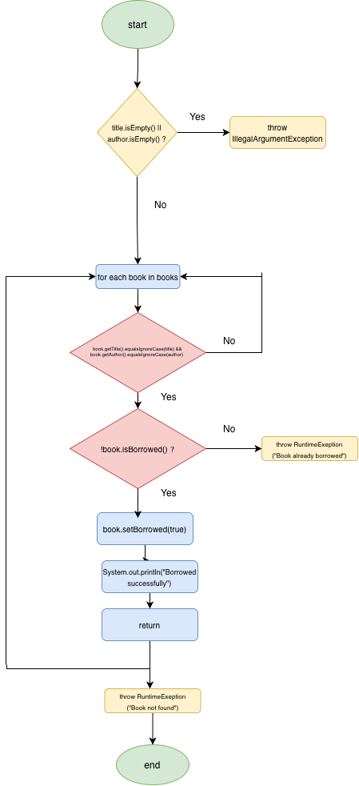

# SI_2026_lab2_232092

**Име и презиме:**   Matea Trajkovska 
**Број на индекс:** 232092

## Control Flow Graph

### searchBookByTitle

### borrowBook

## Цикломатска комплексност

### searchBookByTitle

Цикломатската комплексност е **6**, добиена со формулата V(G) = P + 1, каде P е бројот на предикатни јазли.

Предикатни јазли:
- `title.isEmpty()`
- for циклус
- `book.getTitle().equalsIgnoreCase(title)`
- `!book.isBorrowed()`
- `results.isEmpty()`

V(G) = 5 + 1 = **6**

### borrowBook

Цикломатската комплексност е **5**, добиена со истата формула V(G) = P + 1.

Предикатни јазли:
- `title.isEmpty() || author.isEmpty()`
- for циклус
- `book.getTitle().equalsIgnoreCase(title) && book.getAuthor().equalsIgnoreCase(author)`
- `!book.isBorrowed()`

V(G) = 4 + 1 = **5**

`||` и `&&` се еден предикатен јазол, не два.

## Every Statement — searchBookByTitle

| Тест | Опис | Линии |
|---|---|---|
| T1 | Празен title → IllegalArgumentException | if isEmpty, throw |
| T2 | Книга постои и не е borrowed → враќа листа | for, if true, results.add, return results |
| T3 | Книга не постои → null | for без match, if isEmpty true, return null |
| T4 | Книга е borrowed → null | for, if false, return null |

Минимум тест случаи: **3** (T1, T2, T3). T4 е додаден за поголема покриеност.

## Every Branch — borrowBook

| Тест | Опис | Гранка |
|---|---|---|
| T1 | Празен title → IllegalArgumentException | title.isEmpty() → true |
| T2 | Празен author → IllegalArgumentException | author.isEmpty() → true |
| T3 | Книга е пронајдена, не е borrowed → успешно | !isBorrowed → true |
| T4 | Книга е пронајдена, веќе borrowed → RuntimeException | !isBorrowed → false |
| T5 | Книга не постои → RuntimeException | for завршува без return |

Минимум тест случаи: **4**

## Multiple Condition

### searchBookByTitle — `book.getTitle().equalsIgnoreCase(title) && !book.isBorrowed()`

| Тест | C1 (title match) | C2 (!borrowed) | Резултат |
|---|---|---|---|
| T1 | true | true | се додава |
| T2 | true | false | не се додава |
| T3 | false | true | не се додава |
| T4 | false | false | не се додава |

Минимум: **4** тест случаи

### borrowBook — `title.isEmpty() \|\| author.isEmpty()`

| Тест | C1 (title празен) | C2 (author празен) | Резултат |
|---|---|---|---|
| T1 | true | true | IllegalArgumentException |
| T2 | true | false | IllegalArgumentException |
| T3 | false | true | IllegalArgumentException |
| T4 | false | false | нормално |

Минимум: **4** тест случаи
